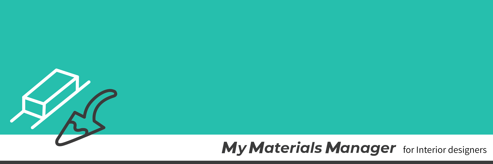
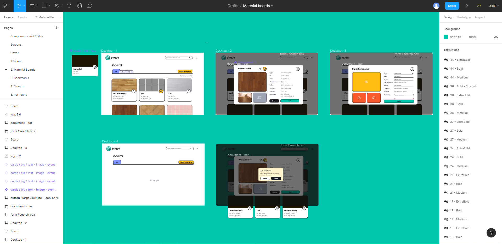

# My Materials Manager

## 1. Introduction

**My Materials Manager, MMM**은 인테리어 디자이너가 프로젝트에 사용하거나 알아본 자재들을 편리하게 관리할 수 있는 웹 어플리케이션입니다. 카드 형태로 자재를 저장하면 board에서 타입 별로 찾아볼 수 있습니다. 아이템은 pdf 형식으로 다운받을 수 있고, 즐겨찾기한 목록을 따로 모아보거나 원하는 검색 키워드로 관련 자재를 찾을 수 있습니다.

### 프로젝트 기간

- 2021.03.01 - 2021.04.11

### 담당 분야

- 개인 프로젝트

### preview


## 2.Features

- 노트북 화면 사이즈를 중심으로 한 반응형 스타일링

- 이메일 주소로 간편한 회원가입 구현

- 자재 내역 등록/수정/삭제 기능
- 자재 타입 별 분류 기능
- 아이템 별 즐겨찾기 기능
- 아이템 별 pdf로 저장하기 기능

- 즐겨찾기한 아이템 모아보기

- 키워드로 내가 가진 자재 검색하기

## 3. Requirements

- 최신 Chrome 브라우저의 사용을 권장합니다.

## 4. 사용 스킬

### 1) Client

- React
- React Router
- Recoil
- PostCSS
- jsPDF / html2canvas

### 2) Server

- ES2015+
- Node.js
- Express
- MongoDB Atlas
- Mongoose
- JSON Web Token
- bcrypt

### 3) Deployment

- Client: Netlify(https://my-materials-manager.netlify.app)
- Server: Heroku(https://my-materials-manager.herokuapp.com/)

## 4. Installation

1. git을 클론합니다.

```
git clone https://github.com/web-doh/mmm.git
cd mmm/
```

2. `.env` 파일을 생성하고 아래 `<>`에 환경변수를 입력한 후, root 디렉토리에 저장합니다.

```
MONGODB_URI=<mongoDB-connection-string>
JWT_SECRET_KEY=<jwt-secret-key>
```

## 5. 프로젝트 관리 툴

- 와이어프레임 설계 : Figma (Contra wireframe kit 응용)
  

- 업무 관리, API 작성 및 오류 노트 작성 : Notion

- 코드 버전 관리 : Git / Github Desktop

## 6. Challenges

본 프로젝트를 진행하면서 겪었던 기술적 어려움들은 아래와 같습니다.

### 1) React 초기 설정

- React를 배운 뒤 CRA만 사용해봤기 때문에 처음부터 설정해보고자 했습니다. Webpack을 처음 사용해보면서 수많은 에러와 직면하게 되었습니다. 실제로도 총 프로젝트 기간 중 절반은 패키지와 Webpack 등 프로젝트 기본 설정에 할애했습니다. CRA와 firebase 등으로 편리하고 빠르게 만들까 싶은 생각도 많이 들었지만 포기하지 않고, 관련 강의나 공식 사이트를 참고하면서 문제를 해결해 나갔습니다.

### 2) 네트워크 통신에 대한 이해

- 실제로 프로젝트를 진행한 것은 한 달 남짓이지만 6개월 전부터 앱 구상을 했습니다. 하지만 그 당시에는 프로그래밍을 접한지 얼마되지 않았던 때라 서버와 클라이언트 간의 통신이 어떻게 이루어지는지 알지 못했습니다. HTTP와 네트워크에 관한 책을 읽고, 그룹 프로젝트인 '부모는 처음이라'를 진행해 보면서 대략적인 관계를 머릿속에 그릴 수 있었습니다. 이번 프로젝트에서 API 작성과 AJAX 통신을 스스로 구현해 보면서 관계에 대해 조금 더 명확하게 파악할 수 있게 되었습니다.

## 7. Things to do

서버와 프런트까지 처음으로 진행한 프로젝트이다보니 간단한 웹 어플리케이션이지만 예상보다 기간이 오래 걸렸습니다. 아직 부족하다고 생각하는 점이 많아 조금씩 수정할 예정입니다.

### 1) 추가하고자 하는 기능

- My page : 계정을 관리하고, 탈퇴하는 기능
- Social login : 네이버, 카카오 계정 연동
- 아이템 카드 공유하기 기능
- 아이템을 이름 순, 가격 순 등으로 정렬하기 혹은 drag-and-drop 배치
- shift 누르고 선택시 한번에 삭제
- item price input 칸에 환전 API 적용해서 현재 환율로 변환한 가격 보여주기

### 2) 개선점

- TypeScript 적용
- Recoil을 활용한 전역 상태 응용
- 리팩토링
